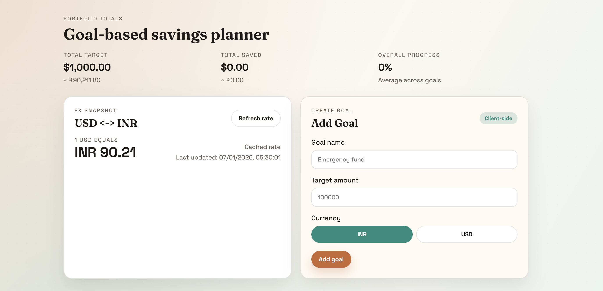
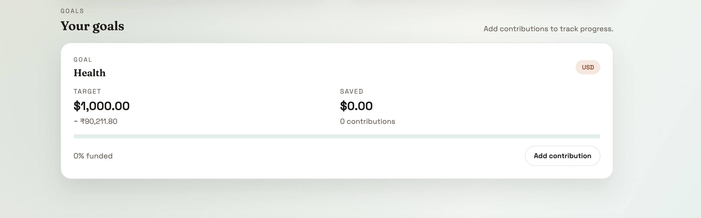

# Goal-Based Savings Planner

Lightweight client side savings planner that supports multi currency goals, live FX refresh, and contribution tracking.

## Setup

```bash
npm install
```

Create a `.env` file:

```bash
VITE_EXCHANGE_API_KEY=your_api_key_here
```

Optional overrides:

```bash
VITE_USE_MOCK_FX=true
VITE_EXCHANGE_API_BASE=https://v6.exchangerate-api.com/v6/your_api_key/latest/USD
```

Run locally:

```bash
npm run dev
```

## Project story (from me)

I built this as the take-home assignment for Syfe's Frontend Intern role. I treated it like a tiny product build rather than a toy demo. First I sketched the two core flows: creating a goal and adding contributions. Once those worked end to end, I pulled the shared math (currency conversion + totals) into small helpers so I could reuse them across the cards and the dashboard. The exchange-rate fetch came next, but I wrapped it in a hook and cached it in localStorage right away so I would not get blocked by rate limits while iterating on the UI.

After the logic felt stable, I spent time on the UI polish. I went with a warm, editorial look using custom CSS, added a few animations for page load and cards, and made sure the layout collapses cleanly on mobile. Everything stays client-side, and I kept the component boundaries clean so the code is easy to follow.

## Code tour (how it fits together)

- `src/App.tsx` is the orchestrator: it loads/saves goals, computes totals, and wires the modal + cards together.
- `src/hooks/useExchangeRate.ts` fetches the USD to INR rate, caches it, and supports a mock response when needed.
- `src/components/GoalForm.tsx` handles validation and goal creation.
- `src/components/GoalCard.tsx` renders each goal and its progress + conversion.
- `src/components/ContributionModal.tsx` collects contribution amount/date and updates the goal.
- `src/components/TotalsBanner.tsx` shows the dashboard summary.
- `src/utils/fx.ts` and `src/utils/format.ts` hold conversion and formatting helpers.
- `src/styles.css` defines the visual system (type, color, layout, motion, and responsive rules).

## Screenshots and features

Screenshot 1: Dashboard + FX + Add Goal



- Portfolio totals (total target, total saved, average progress).
- FX snapshot with USD <-> INR, last updated time, and refresh button.
- Add Goal form with name, target amount, and currency toggle + validation.

Screenshot 2: Goal card + progress



- Goal card showing target, converted target, saved amount, and contribution count.
- Progress bar and percent funded.
- Add contribution CTA that opens the modal for amount + date.

## Decisions

- **Vite + React + TypeScript** for fast setup and a clean component structure.
- **LocalStorage caching** for goals and FX rates to avoid rate-limit issues and preserve progress across reloads.
- **Fallback FX rate** if the API is unavailable; the UI calls this out so the user knows when the value is cached or stale.
- **Pure CSS styling** with a custom layout and motion to keep the UI clean and responsive.

## Notes

- The FX API endpoint expects a valid API key from exchangerate-api.com.
- To use the included mock response, set `VITE_USE_MOCK_FX=true`. It loads `public/mock-fx.json` so I can keep testing even if the API rate limit kicks in.
- When `VITE_USE_MOCK_FX=false` (or missing), the app uses the live exchange-rate API via `VITE_EXCHANGE_API_KEY`.
- You can also point `VITE_EXCHANGE_API_BASE` to your own endpoint to mock or proxy the data.

Thanks - Zaid
